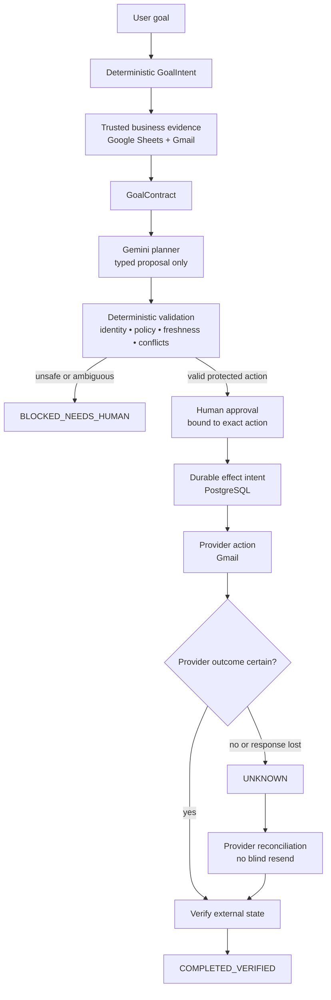

# ProofOps — Verified Autonomous Operations Agent

ProofOps is a reliability layer for autonomous agents that prevents an attempted external action from being mistaken for a verified real-world outcome.

**ATTEMPTED ≠ COMPLETED**

**AI proposes. Deterministic systems authorize, execute, verify, and prove.**

| | |
| --- | --- |
| Live demo | [proofops-api-production.up.railway.app](https://proofops-api-production.up.railway.app) |
| Source | [github.com/saikiranpulagalla/proofops](https://github.com/saikiranpulagalla/proofops) |
| Hackathon | AI Build Challenge 2026 by Build Fast with AI |
| Track | PS-01 — Autonomous Agents for Everyday Apps |
| Candidate | RC11 (`1.0.0rc11`) |
| Deterministic suite | **402 / 402 PASS** for the frozen RC11 run |

The live UI requires credentials supplied separately with the hackathon submission. It uses synthetic qualification data; please do not trigger repeated consequential actions during evaluation.

## The problem

An autonomous agent sends an email. The provider commits it, but the network response is lost. A naïve agent sees an error and retries—creating a duplicate customer message.

That is a distributed-systems problem, not an email-writing problem. An API response is not the same thing as the state of an external effect. The same failure class appears in payments, bookings, ticket creation, CRM updates, cloud operations, and other consequential actions that cannot safely be repeated on uncertainty.

ProofOps makes uncertainty explicit. An AI-generated proposal passes through trusted evidence, deterministic validation, human authorization, durable effect state, provider reconciliation, and evidence-backed completion.

## What makes ProofOps different

| Ordinary agent pattern | ProofOps |
| --- | --- |
| LLM decides and acts | Gemini produces a typed proposal; deterministic code controls protected effects. |
| API success means success | The provider-visible effect must be verified. |
| A timeout means retry | An ambiguous provider outcome becomes `UNKNOWN`. |
| Retrying may duplicate the effect | Reconciliation is required before any resend path is considered. |
| Approval is generic | Approval is bound to the exact protected action. |
| Missing or conflicting evidence is guessed | The workflow blocks or requires human handling. |

The design centers trusted business evidence, typed proposals, deterministic validation, approval binding, durable effect state, provider reconciliation, and verified completion.

## 60-second judge path

1. Open the [live demo](https://proofops-api-production.up.railway.app) and sign in with the test credentials supplied in the submission.
2. Inspect the synthetic renewal run and its timeline.
3. Observe the safe path `CREATED → RESOLVING → BLOCKED_NEEDS_HUMAN`: ProofOps refuses to manufacture a consequential action when it cannot safely proceed.
4. Review the Gmail response-loss evidence below: `UNKNOWN` was observed, reconciliation recovered the one committed message, and no resend occurred.

The UI demonstration and the Gmail response-loss qualification are distinct evidence. This README does not claim that the current UI contains a historical `COMPLETED_VERIFIED` Gmail qualification run.

## Architecture



Gemini can propose semantics; it does not directly authorize or perform the protected effect. The FastAPI application composes the runtime adapters, while the domain, policy, approval, effect, and completion layers own the deterministic safety boundary.

## Reliability model

```text
Goal → Evidence → Proposal → Validation → Approval → Durable Effect
     → Provider Action → Reconciliation → Verified Completion
```

### Before the effect

If identity, business evidence, freshness, policy, or user intent cannot be established safely, the run enters `BLOCKED_NEEDS_HUMAN`. An LLM suggestion does not override that decision.

### After an attempted effect

If ProofOps cannot determine whether a provider committed an operation, it records `UNKNOWN` rather than assuming failure:

```text
UNKNOWN → reconcile provider state → verify evidence → COMPLETED_VERIFIED
```

Uncertainty is not blind-resend permission.

## Proven failure-mode behavior

Fresh RC11 Gmail qualification exercised the failure shape that matters: one self-addressed provider effect committed, the response was intentionally lost, and reconciliation recovered authoritative provider evidence without sending again.

| Property | Result |
| --- | --- |
| Response loss injected | PASS |
| `UNKNOWN` observed | PASS |
| Reconciled without resend | PASS |
| Physical messages for one logical effect | **1** |
| Provider message ID bound | PASS |
| Sent evidence verified | PASS |
| Sender verified | PASS |
| Qualification evidence | Signed receipt present |

The qualified evidence recorded authoritative Gmail thread intent as `ACCEPTED`. No OAuth token, message body, provider identifier, or receipt secret is published here.

## Demo

The [deployed application](https://proofops-api-production.up.railway.app) demonstrates two complementary ideas.

### Fail closed before execution

```text
CREATED → RESOLVING → BLOCKED_NEEDS_HUMAN
```

This is a successful safety outcome: the system refused to generate or execute an unsafe action.

### Recover after response loss

```text
provider effect committed → response lost → UNKNOWN → reconciliation
→ no blind resend → one physical message → verified evidence
```

This is the central ProofOps claim: an agent should prove what happened instead of claiming success merely because it attempted an action.

## Technologies

| Layer | Technology | Role |
| --- | --- | --- |
| Runtime | Python 3.12+ | Application and release-tooling runtime |
| API | FastAPI, Pydantic, Uvicorn | HTTP API, schemas, and ASGI serving |
| Persistence | SQLAlchemy | Domain persistence and transaction boundary |
| Migrations | Alembic | Schema migration management; current head is `0012` |
| Live database | PostgreSQL via `psycopg` | Durable live effect and approval state |
| Offline demo | SQLite | Local deterministic demo storage |
| Business evidence | Google Sheets API | Synthetic CRM-style renewal evidence |
| Provider evidence/action | Gmail API | Email evidence, send, and reconciliation |
| AI planning | Google Gen AI `google-genai` Interactions API | Structured plan proposals; no tool access from the planner |
| Deployment | Docker and Railway | Containerized live demonstration |
| Testing | pytest, pytest-asyncio, Hypothesis, HTTPX | Deterministic, API, adversarial, and property-oriented tests |
| UI | Plain HTML, CSS, and JavaScript served by FastAPI | Lightweight authenticated operator interface |

## Repository structure

```text
proofops/
├── app/
│   ├── adapters/       # Gmail, Sheets, Gemini, and fake/demo adapters
│   ├── api/            # FastAPI app, runtime composition, and UI
│   ├── domain/         # States, entities, and safety vocabulary
│   ├── engine/         # Workflow, effects, completion, truth, orchestration
│   ├── persistence/    # SQLAlchemy models and repository operations
│   ├── planning/       # Typed proposal and deterministic validation
│   ├── release/        # Qualification receipt and release validation
│   └── security/       # Canonicalization, approval, and policy boundaries
├── alembic/             # Migration environment and 0001–0012 history
├── scripts/             # Demo, qualification, smoke, promotion, verification tools
├── tests/               # Deterministic and adversarial regression suite
├── Dockerfile            # Container build and startup path
├── deploy.env.example    # Safe configuration-name reference
├── pyproject.toml        # Package metadata and optional dependency groups
└── README.md
```

## Setup

### Prerequisites

- Python **3.12+**
- Git
- PostgreSQL for a real live-provider deployment; the offline demo uses SQLite
- Docker is optional for the containerized deployment path

### Clone

```bash
git clone https://github.com/saikiranpulagalla/proofops.git
cd proofops
```

### Environment

Use [`deploy.env.example`](deploy.env.example) as the checked-in reference for configuration names. Keep local values outside Git. The offline demo does not need Gmail, Sheets, Gemini, or Railway credentials; real-provider mode does.

Never commit `.env` files, OAuth tokens, Gemini API keys, database passwords, UI passwords, session secrets, qualification HMAC secrets, private signing keys, or SSH private keys.

### Install

```bash
python -m venv .venv
```

Windows PowerShell:

```powershell
.venv\Scripts\Activate.ps1
```

macOS/Linux:

```bash
source .venv/bin/activate
```

```bash
python -m pip install --upgrade pip
python -m pip install -e ".[dev]"
```

For a dedicated live qualification/deployment environment, the repository defines a broader optional dependency set:

```bash
python -m pip install -e ".[release]"
```

## Run locally

### Local offline demo

The safest way to inspect the workflow without provider credentials is the deterministic API demo:

```bash
python scripts/demo_v09_api.py
```

It uses demo adapters and local SQLite storage, demonstrates authenticated API handling and idempotent execution, and prints a concise result including one fake-provider effect.

### Interactive demo mode

For the FastAPI UI, set your own non-placeholder local values according to `deploy.env.example`, then select demo mode:

```powershell
$env:PROOFOPS_RUNTIME = "demo"
$env:PROOFOPS_SESSION_SECRET = "<your 32+ byte local secret>"
$env:PROOFOPS_UI_PASSWORD = "<your strong local password>"
python -m uvicorn app.api.main:app --reload
```

Open <http://127.0.0.1:8000>. Do not use production credentials locally.

### Live-provider mode

Live mode is intentionally strict. It requires PostgreSQL, approved Google configuration, Gemini configuration, identity-bound synthetic data, and explicit provider-effect safeguards. It is separate from normal startup and is not required for a hackathon evaluator to understand or test the project.

## Tests

```bash
pytest -q
```

RC11's frozen deterministic suite passed **402 / 402** tests. Coverage includes state transitions, approval and policy binding, evidence freshness, idempotency, API boundaries, provider containment, response-loss handling, reconciliation, migration/release validation, and adversarial behavior.

The ordinary offline preflight is also available:

```bash
python scripts/qualify_v10.py
```

Live smoke scripts, five-gate qualification, and promotion tooling deliberately require explicit live configuration and are not part of the normal quickstart.

## Core invariants

1. Ambiguous or conflicting evidence does not silently authorize an action.
2. The business record is rechecked for freshness before a protected effect.
3. Approval is bound to the action being executed.
4. Consequential execution has durable effect state at the provider boundary.
5. Uncertain provider outcomes become `UNKNOWN`.
6. `UNKNOWN` is reconciled before any resend path is considered.
7. `COMPLETED_VERIFIED` requires authoritative evidence of the external outcome.

## Safety boundaries

| Risk | ProofOps response |
| --- | --- |
| Conflicting evidence or subject ambiguity | Block and require human handling |
| Stale business state | Re-evaluate before the effect; invalidate unsafe execution |
| Lost provider response | Record `UNKNOWN` and reconcile provider evidence |
| Potential duplicate send | Do not blindly resend; require reconciliation |
| Unapproved protected action | Reject at the deterministic approval boundary |
| Unsafe planner proposal | Reject through deterministic identity, policy, freshness, and conflict checks |

## Qualification status

ProofOps uses a five-gate internal release standard that is intentionally stricter than merely demonstrating the hackathon application.

| Gate | RC11 status |
| --- | --- |
| Deterministic tests | **402 / 402 PASS** |
| PostgreSQL live qualification | PASS |
| Google Sheets live qualification | PASS |
| Gmail live qualification | PASS |
| Gemini live qualification | `BLOCKED_EXTERNAL` |
| Deployed E2E release qualification | Not completed |
| Full five-gate qualification | **Fail-closed / incomplete** |

The live Gemini qualification gate was attempted against the deployed RC11 model and failed closed on external provider/quota availability. No Gemini PASS receipt was fabricated. Because the Gemini gate is incomplete, deployed E2E qualification and promotion remain incomplete as well.

## AI tools used

### Product runtime AI

ProofOps uses the Google Gen AI SDK (`google-genai`) and its Interactions API for structured planning proposals. The checked-in runtime default is `gemini-3.8-flash`, configurable through `PROOFOPS_GEMINI_MODEL`. Gemini supplies a typed proposal only; deterministic code retains authorization, execution, and verification authority.

### Development tools

This repository does not make a separate development-AI attribution claim. The runtime AI integration above is the documented product dependency.

## Current limitations

- The current demonstration focuses on renewal outreach.
- Gemini live semantic qualification is externally blocked by provider availability/quota under the zero-budget constraint.
- Deployed E2E release qualification is consequently incomplete.
- ProofOps is a hackathon reliability prototype, not a claim of universal production certification.

## Maintainer-only release tooling

The repository retains qualification, receipt verification, and promotion scripts under `scripts/` for the dedicated synthetic release environment. They are intentionally not part of the quickstart. Do not run live Gmail, Sheets, Gemini, E2E, or promotion commands against personal or customer data without that environment and explicit operational approval.

---

ProofOps is not primarily an email-writing agent. It is a reliability and verification layer for consequential autonomous actions—built around one durable idea:

**ATTEMPTED ≠ COMPLETED**
